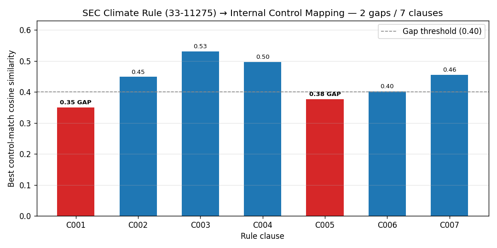

# c4-reg-nlp

**Regulatory rule -> internal control mapper** with semantic search + gap detection.
Built for the legal-tech / RegTech segment of Yash Patel's finance portfolio.

## Demo



```text
$ python scripts/run_demo.py
Rule -> Control mapping (7 clauses, 40 controls, threshold=0.40)
  C001  -        SEC 33-11275 header                CC-2.1   0.351   GAP
  C002  Sec 1    Material climate risks             CC-2.2   0.449   ok
  C003  Sec 2    Governance and oversight           CC-1.2   0.531   ok
  C004  Sec 3    Risk management processes          CC-2.2   0.497   ok
  C005  Sec 4    GHG emissions disclosure           CC-2.1   0.377   GAP
  C006  Sec 5    Financial statement effects        CC-2.1   0.402   ok
  C007  Sec 6    Internal controls and attestation  CC-4.1   0.455   ok
2 potential control-library gaps flagged.
```

Full output: [`docs/cli-demo.txt`](docs/cli-demo.txt) | Mapping CSV: [`docs/sample-mapping.csv`](docs/sample-mapping.csv) | Gaps JSON: [`docs/gaps.json`](docs/gaps.json)

---

## What it does

1. Loads a curated taxonomy of internal controls (30 NIST SP 800-53 rev 5 + 10 COSO 2013).
2. Loads a proposed SEC/CFTC regulatory rule text (sample: SEC final rule 33-11275, climate disclosures, March 2024).
3. Segments the rule into clauses.
4. Embeds clauses + controls with `sentence-transformers/all-MiniLM-L6-v2` (free, local, no API key).
5. For each clause, returns the top-K most semantically similar controls by cosine similarity.
6. Flags clauses whose best-match similarity falls below a threshold as **potential gaps** in the existing control library.
7. Persists control embeddings in a local `chromadb` store.

## Why it matters

- Demonstrates legal-tech + RegTech NLP capability without requiring any paid API.
- Mirrors the workflow a financial-services compliance team performs manually when a new rule is proposed: read clause, ask "do we already have a control covering this?".
- Reproducible (random seed = 42), small footprint (~90 MB model download).

## Quickstart

```bash
pip install -e ".[dev]"

# Run end-to-end demo (writes docs/sample-mapping.csv + docs/gaps.json)
python scripts/run_demo.py

# Launch Streamlit UI
streamlit run app.py

# Run tests
pytest -q
```

## Repo layout

```
data/
  controls.json            # 30 NIST + 10 COSO entries
  sample_rule.txt          # SEC climate-disclosure rule excerpt (public domain)
  chroma/                  # local chromadb store (gitignored)
src/c4_reg_nlp/
  taxonomy.py              # load + represent controls
  regtext.py               # fetch + segment rule text
  embed.py                 # sentence-transformers + chromadb integration
  match.py                 # top-K similarity + gap detection
app.py                     # Streamlit UI
scripts/run_demo.py        # CLI runner
tests/                     # pytest suite (taxonomy, regtext, embed, match, smoke)
docs/                      # generated artifacts (sample-mapping.csv, gaps.json)
```

## Model & data

- **Embedding model:** `sentence-transformers/all-MiniLM-L6-v2` (384-dim, ~90 MB, MIT license, local).
- **Vector store:** `chromadb` PersistentClient at `data/chroma/` (gitignored).
- **Random state:** `42` everywhere it matters.
- **No API keys.** First run downloads the model from HuggingFace.

## Author

Yash Patel | Tempe, AZ | yashpatel06050@gmail.com
LinkedIn: linkedin.com/in/yash-patel-67449029b
GitHub: github.com/ypatel39-commits
